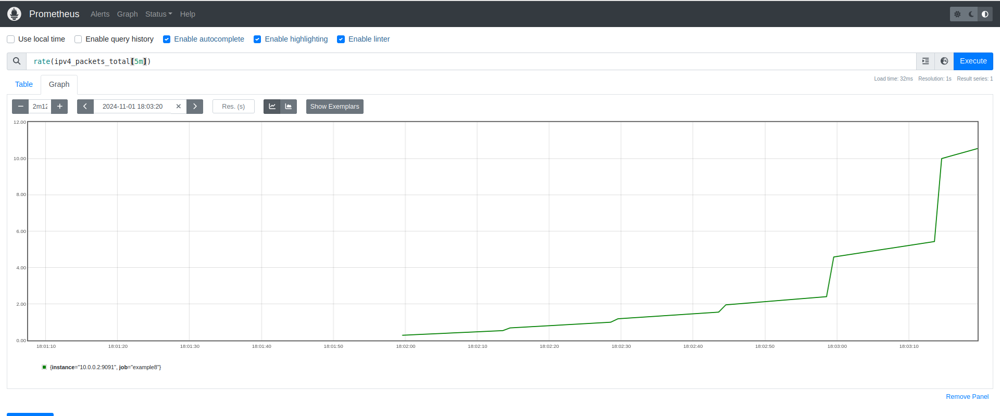
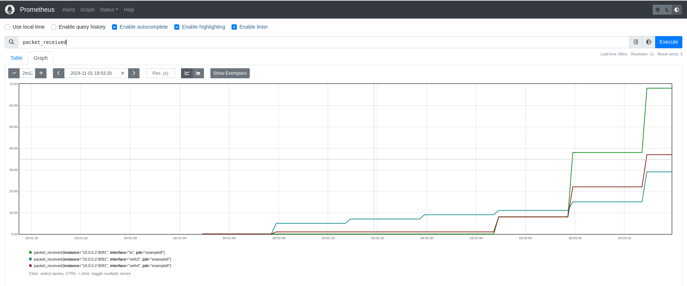

# xdp examples

This directory is used only for xdp examples.

### Table Of Contents

* [Example 1](#example-1)
* [Example 2](#example-2)
* [Example 3](#example-3)
* [Example 4](#example-4)
* [Example 5](#example-5)
* [Example 6](#example-6)
* [Example 6_2](#example-6_2)
* [Example 7](#example-7)
* [Example 8](#example-8)


### [Example 1](./example1/README.md)

This program is a simple XDP probe that counts the number of IPv4 packets. It checks if it is Ethernet, IPv4 and not malformed. The controlplane reads the value from an eBPF array map.


### [Example 2](./example2/)

This program is similar to example1 but designed for IPv6. To achieve this, I added a struct for the IPv6 header in the `common.h` header file, along with the value for the IPv6 protocol found within the Ethernet header.

### [Example 3](./example3/)

This program is the same as example2 but instead of using `common.h` it uses `vmlinux.h`. 

To generate the `vmlinux.h` file you can use bpftool: `bpftool btf dump file /sys/kernel/btf/vmlinux form c >> vmlinux.h`.

### [Example 4](./example4/)

This program counts IPv4 packets for TCP, UDP, ICMP, and Other protocols. Here *Other* refers other protocols, such as SCTP.

The map used is a hash map with 4 keys representing the protocols: TCP, UDP, ICMP, Other.

The output will look something like that:
```
2024/10/05 11:33:21 Map contents:
        ICMP => 4
        Other => 130
        UDP => 8
```

Note: you can use iperf3 to generate SCTP traffic. For iperf3 server: `iperf3 -s` and for iperf3 client `iperf3 -c 127.0.0.1 --sctp`.


### [Example 5](./example5/)

This example is the same as example1 but allows the user to select an interface. Only the controlplane part has changed.


### [Example 6](./example6/)

In this example I'm using the `bpf_redirect` helper to redirect traffic to another interface. To test it, we can proced as follows:
* Create a veth pair and set both peers up:
  ```
  sudo ip link add veth0 type veth peer name veth1
  sudo ip link set dev veth0 up
  sudo ip link set dev veth1 up
  ```
* Before compiling the XDP program, determine the `ifindex` of the interface to which traffic will be redirected, i.e., `loopback -> veth0 <==> veth1`. We retrieve the `ifindex` (using `ip link`) and set this value in the `xdp.c` code as the `if_index`.
* Compile the binary using the provided Makefile.
* Use the command `sudo ./example6 lo`, which attaches the XDP program to the loopback interface of the default network namespace.
* Now, if you execute `ping 127.0.0.1`, all traffic to the loopback interface will be redirected to `veth0`. View the redirected traffic by running tcpdump on the `veth1` peer: `sudo tcpdump -i veth1`.


Notes:
* From the `bpf_helpers` documentation on `bpf_redirect`: "Currently, XDP only supports redirection to the egress interface, and accepts no flag at all. The same effect can also be attained with the more generic bpf_redirect_map(), which uses a BPF map to store the redirect target instead of providing it directly to the helper."
* To understand why we need to use `return bpf_redirect(...)`, refer to [this documentation](https://www.kernel.org/doc/html/latest/bpf/redirect.html). Indeed if we call `bpf_redirect(...)` and then return `XDP_PASS`, it will not work as expected. Try it!
* In the next example, we will see how to retrieve the `ifindex` from a map instead of using a hardcoded value.


### [Example 6_2](./example6_2/)

This example is the same as the previous one but the ifindex is written by the controlplane in a eBPF map, which the dataplane then reads. To use it, run the program: `sudo ./example6_2 <Attach-Interface> <Redirect-Interace>`, for example `sudo ./example6_2 lo veth0`, the program will be attached to the `loopback` interface and the traffic will be redirect to the `veth0` interface.

We can check the content of the BPF map `ifindex_map` using bpftool:
```
sudo bpftool map show
...
47: array  name ifindex_map  flags 0x0
	key 4B  value 4B  max_entries 1  memlock 328B
```
Then:
```
sudo bpftool map dump id 47
key: 00 00 00 00  value: 09 00 00 00
```
We can check that the value corresponds to the ifindex with:
```
ip link
8: veth1@veth0: <BROADCAST,MULTICAST,UP,LOWER_UP> mtu 1500 qdisc noqueue state UP mode DEFAULT group default qlen 1000
    link/ether 16:dd:a3:97:f1:bd brd ff:ff:ff:ff:ff:ff
9: veth0@veth1: <BROADCAST,MULTICAST,UP,LOWER_UP> mtu 1500 qdisc noqueue state UP mode DEFAULT group default qlen 1000
    link/ether 7a:a1:2c:6e:67:67 brd ff:ff:ff:ff:ff:ff
```


### [Example 7](./example7/)

This example attaches an XDP program to all interfaces that are up and are either Loopback or Veth. I'm using [netlink](https://github.com/vishvananda/ne
tlink). It counts the packets on all interfaces. There is another map that counts the packets per interface, where the key is the interface number (which 
the control plane converts to the interface name), and the value is the packet count.

To test it:
* Use the `testbed.sh` script to create an example testbed with a netns `ns1` and 2 veth pairs (2 peers inside ns1 and 2 peers in the default nents).
* Run the eBPF program in the `ns1` namespace 
```
└─[$] <git:(main*)> sudo ip netns exec ns1 ./bin/example7
Name: lo, Index: 1, Type: device
Name: veth2, Index: 6, Type: veth
Name: veth4, Index: 8, Type: veth
2024/10/08 09:46:52 Counter map 0
2024/10/08 09:46:52 Interface map:
	lo => 0
	veth2 => 0
	veth4 => 0
```
* Then create traffic like `ping 10.0.0.2` (for veth2) and `ping 10.0.1.2` (for veth4). You will see something like that:
```
2024/10/08 09:46:55 Counter map 5
2024/10/08 09:46:55 Interface map:
	lo => 0
	veth2 => 3
	veth4 => 2
2024/10/08 09:46:58 Counter map 11
2024/10/08 09:46:58 Interface map:
	lo => 0
	veth2 => 6
	veth4 => 5
2024/10/08 09:47:01 Counter map 17
2024/10/08 09:47:01 Interface map:
	lo => 0
	veth2 => 9
	veth4 => 8
2024/10/08 09:47:04 Counter map 23
2024/10/08 09:47:04 Interface map:
	lo => 0
	veth2 => 12
	veth4 => 11
```

### [Example 8](./example8/)

This example is similar to the previous one, but it exposes some metrics using the **Prometheus go library**.

Let's create the testbed using the provided script: `sudo ./tesbed.sh`.

A simple and fast way to use Prometheus is as follows:
```
cd xdp/example8
docker run \
    -p 9090:9090 \
    -v ./prometheus.yaml:/etc/prometheus/prometheus.yml \
    prom/prometheus
```
The provided `prometheus.yaml` is created starting from [here](https://prometheus.io/docs/prometheus/latest/getting_started/). Note that the target is important `targets: ['10.0.0.2:9091']` and it works because I'm using the `testbed.sh` script to create a proper testbed.

You can access the Prometheus graph page here [http://localhost:9090/graph](http://localhost:9090/graph) (actually also here [http://10.0.0.1:9090/graph](http://10.0.0.1:9090/graph) using the ip address of `veth1` or also 10.0.1.2 using `veth3`).

Now if you go to `Status->Targets` there is a target called `example8` that is currently `DOWN`. That's because we have not yet run `example8`. Let's run it:
```
└─[$] <git:(main*)> sudo ip netns exec ns1 ./bin/example8
Name: lo, Index: 1, Type: device
Name: veth2, Index: 31, Type: veth
Name: veth4, Index: 33, Type: veth
2024/11/01 19:01:38 Counter eBPF map 0
2024/11/01 19:01:38 Interface map:
	veth4 => 0
	lo => 0
	veth2 => 0

```
Now if you refresh the page (after few seconds), the target `example8` is now `UP`. 

The `example8` is attached to all the interfaces in the `ns1` network namespace: `lo`, `veth2` and `veth4`. 

After creating traffic, for example:
```
sudo ip netns exec ns1  ping 127.0.0.1 # for ns1 lo
ping 10.0.0.2 # for veth2
sudo ip netns exec ns1 ping 10.0.0.1 # also for veth2
ping 10.0.1.2 # for veth4
sudo ip netns exec ns1 ping 10.0.1.1 # also for veth4
```

You can go to the Graph and see the metrics:
* `ipv4_packets_total` (counter): it is the total number of IPv4 packets received in ingress using XDP program. For example you can use `rate(ipv4_packets_total[5m])` that computes the per-second average rate of increase of the counter over the last 5 minutes.

* `packet_received` (gauge): it is the number of IPv4 packets currently received in ingress by an interface using XDP program. This metric has one important label that is the interface name.


**Note**: remember that XDP operates only on the ingress path of the interface!